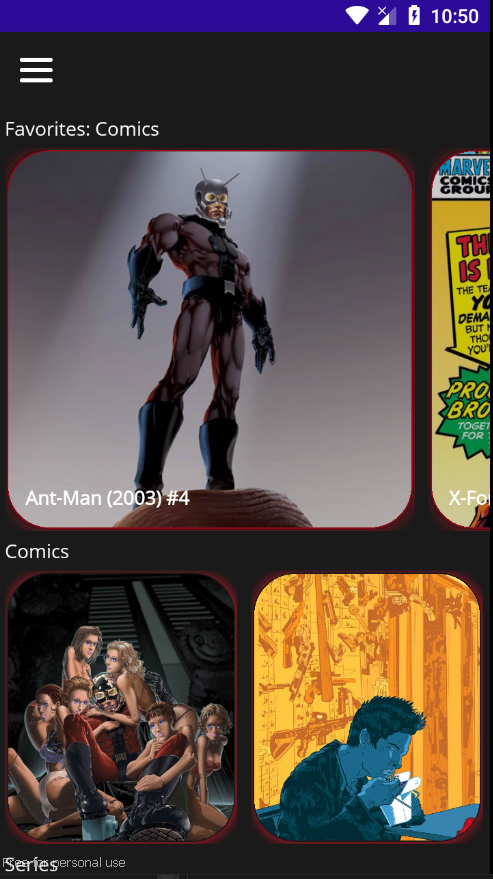
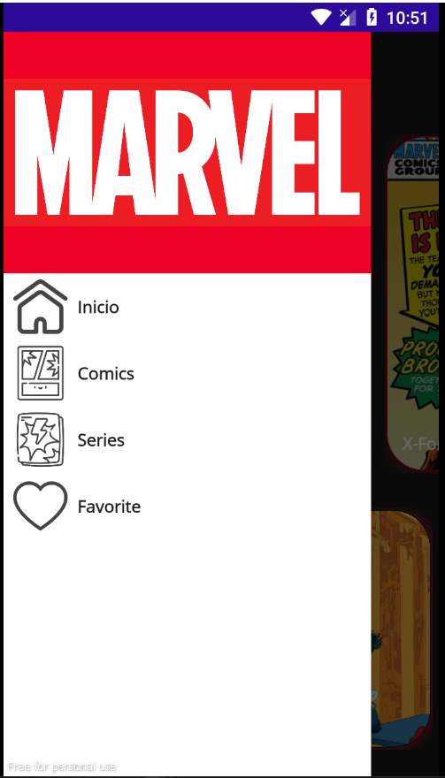
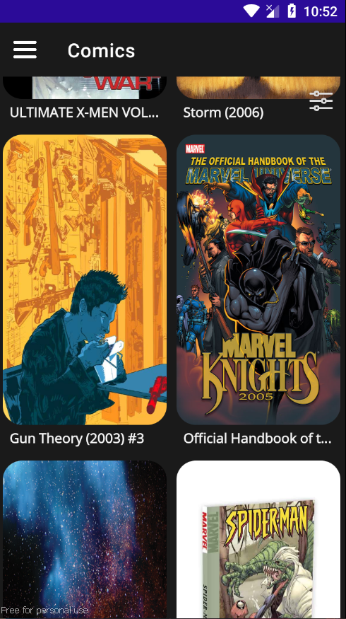
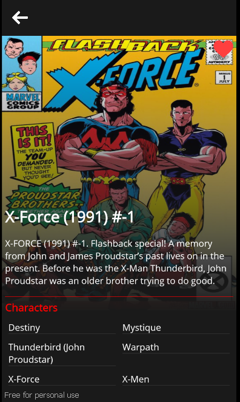

<h1> COMU </h1>
This is a simple example with Maui. In this app I get information about comics and series using the Marvel API. 

In this project I used:  
* Maui  
* SQLite  
* MVVM  
* Simple animations

## <h2> Screens </H2> ##

<i> Home </i>  
On this page you can see 3 lists: favorite comics added, comics and series.  
  

<i> Menu - Shell flyout </i>  

  

<i> Series or comics </i>  
On this page you can see a list of comics or a list of series. 
  
<i> No Internet </i>  
If there is no internet connection, this screen will be displayed 
  
<i> Datail </i>  
This page is to show details of a comic or series 
  
show character 

 
 
